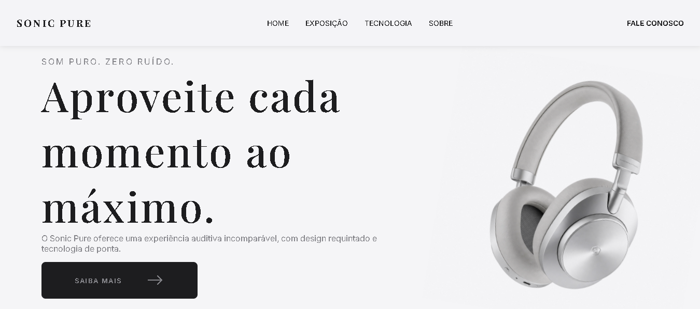

# 🎧 Sonic Pure - Landing Page

Este projeto é uma landing page de alta fidelidade para o **Sonic Pure**, um fone de ouvido fictício de luxo. O objetivo principal foi praticar o desenvolvimento de interfaces modernas, focando em tipografia elegante, espaçamento e design responsivo.

## 🚀 Tecnologias
- **HTML5**: Estrutura semântica.
- **CSS3**: Estilização avançada, Flexbox e Grid.
- **Google Fonts**: Fontes *Playfair Display* e *Inter*.
- **Bootstrap Icons**: Utilizados icones do bootstrap.

## ✨ Funcionalidades
- [x] Layout Responsivo (Mobile, Tablet e Desktop).
- [x] Seção "Sobre Nós" com narrativa de marca.
- [x] Animação suave feita com scroll-behavior.
- [x] Animação de opacidade com JS puro.
- [x] Cards de tecnologia com efeitos de hover.
- [x] Design minimalista focado em produtos de luxo.

## 📸 Preview

## 🧠 Aprendizados
Durante o desenvolvimento deste projeto, foquei em:
1. **Hierarquia Visual**: Como usar diferentes pesos de fonte e tamanhos para guiar o olhar do usuário.
2. **Espaço em Branco**: A importância do respiro no design para passar uma sensação de produto premium.
3. **Organização de Código**: Separação clara entre estrutura (HTML) e estilo (CSS).

## 🛠️ Como rodar o projeto
1. Clone este repositório.
2. Abra o arquivo `index.html` em qualquer navegador.

---
Projeto desenvolvido para fins de estudo de Desenvolvimento Web.
